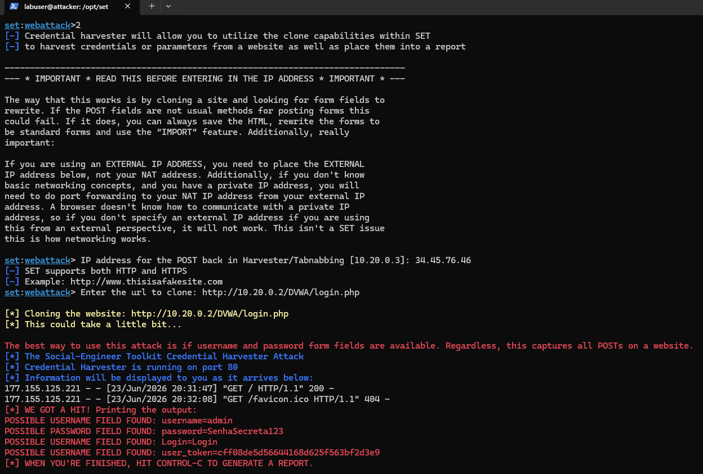
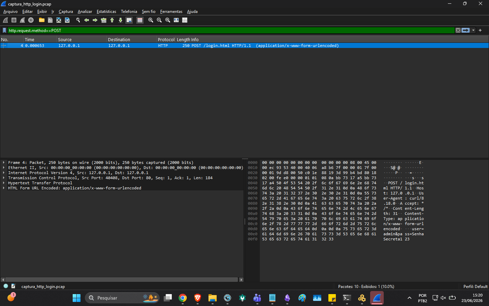

# ☁️🔐 Cloud Security Lab — Offensive & Defensive (GCP)

A hands-on **offensive _and_ defensive** security lab, built **entirely on Google Cloud (GCP) from the command line** (`gcloud`, infrastructure-as-code). Five real-world attack techniques are reproduced end-to-end along the **Cyber Kill Chain**, and the report pairs each one with its **detection, forensic auditing and mitigation**. Three of the five were detected in the lab's own logs; the note under the attack table says which controls ran and which are recommendations.

> 📄 **Full technical report (PT-BR, with real terminal evidence):** [`docs/relatorio-laboratorio-seguranca-gcp.pdf`](docs/relatorio-laboratorio-seguranca-gcp.pdf)
> 🌐 **Portfolio:** [oguarni.github.io](https://oguarni.github.io/)

---

## 🏗️ Architecture

Two **Ubuntu 22.04** VMs in an isolated VPC, provisioned as code, with **firewall logging** and **flow logs** enabled from day one:

```
                          Internet
                             │  (operator IP only, /32)
                ┌────────────┴──────────────┐
                │   GCP — project lab-seg   │
                │   VPC: lab-net            │
                │   Subnet: 10.10.0.0/24    │
                │                           │
   ┌────────────┴────────┐        ┌─────────┴───────────────┐
   │  VM: atacante       │  LAN   │  VM: alvo               │
   │  Ubuntu 22.04       │◄──────►│  Ubuntu 22.04           │
   │  nmap, hydra,       │ 10.10. │  Apache+DVWA (80)       │
   │  sqlmap, tshark,    │ 0.0/24 │  SSH (22)               │
   │  SET, nikto         │        │  vsftpd (21)            │
   │  IP: 10.10.0.3      │        │  Ops Agent · 10.10.0.2  │
   └─────────────────────┘        └─────────────────────────┘
        Firewall (logging): allow-internal, allow-ssh-admin, allow-web
        Observability: VPC Flow Logs + Firewall Logging + Cloud Logging
```

- **`atacante`** — offensive toolbox: `nmap`, `hydra`, `sqlmap`, `tshark`, `SET`, `nikto`
- **`alvo`** — vulnerable target: `Apache+DVWA`, `SSH`, `vsftpd`, `Ops Agent`
- **Auditing:** VPC Flow Logs · Firewall Rules Logging · Cloud Logging (Ops Agent)

Spin the whole lab up and tear it down with two scripts:

```bash
bash scripts/00-provisionar-lab-gcp.sh   # create VPC, firewall (w/ logging), 2 VMs
bash scripts/99-destruir-lab-gcp.sh      # destroy everything (ethics + cost control)
```

The VMs configure themselves via startup scripts ([`startup-atacante.sh`](scripts/startup-atacante.sh), [`startup-alvo.sh`](scripts/startup-alvo.sh)) — **infrastructure as code**, reproducible and disposable.

---

## ⚔️ Attacks → 🛡️ Defenses

Each technique maps to a **Cyber Kill Chain** phase and to a **real recent incident**, and the report pairs it with a detection and a mitigation:

| # | Kill Chain phase | Attack | Tool | Detection & mitigation | Real-world case |
|:-:|---|---|---|---|---|
| 1 | Initial access (web) | **SQL Injection** | sqlmap / DVWA | Apache log signatures · prepared statements · WAF | MOVEit / Clop (2023) |
| 2 | Credential access | **SSH brute force** | Hydra | `auth.log` + Cloud Logging · **Fail2Ban** · key auth + MFA | SSH brute-force botnets (2023–24) |
| 3 | Reconnaissance | **Port scan & FW evasion** | Nmap | VPC Flow Logs · Firewall Logging · Cloud IDS | — |
| 4 | Initial access (human) | **Phishing / credential harvesting** | SET | awareness training · phishing-resistant **MFA (FIDO2)** | 0ktapus / Scattered Spider |
| 5 | Collection / exfiltration | **HTTP sniffing** | Wireshark | **TLS/HTTPS** · GCP Packet Mirroring · Cloud IDS | — |

Not everything in this table ran in the lab. Three techniques were detected there: the SQL injection in Apache's access log on the target, the SSH brute force in `auth.log` (forwarded to Cloud Logging by the Ops Agent) and in VPC Flow Logs, and the port scan in VPC Flow Logs and Firewall Logging. Phishing and sniffing weren't detected. Of the mitigations, only Fail2Ban was deployed; the report lists prepared statements, a WAF, key auth, MFA, TLS/HTTPS and awareness training as recommended measures. Cloud IDS and Packet Mirroring are recommendations too. The report describes them, but I didn't deploy either one in this lab.

A **simulated incident-response policy** based on **NIST SP 800-61** ties it together (detection → containment → eradication → recovery → lessons learned), with measured response metrics (e.g., Fail2Ban contained the brute force in **3 failed attempts**).

---

## 🔎 Sample evidence (real runs)

**Credential harvesting with SET** — the cloned login page captures the victim's credentials (`WE GOT A HIT!`):



This run used a separate attacker/target pair in `10.20.0.0/24`, which these scripts don't create, and the cloned page was served on the attacker's public IP (report, section 6). The victim's source address is redacted in the screenshot.

**HTTP sniffing with Wireshark** — credentials travel in clear text over HTTP (`user=admin&pass=…`):



This screenshot and the capture below come from a reproduction on my own workstation over loopback (`127.0.0.1`), not from traffic between the lab VMs. The VM-to-VM capture (`10.10.0.3 → 10.10.0.2`) is the tshark output in the report (section 7).

> The capture from that reproduction is included: [`screenshots/captura_http_login.pcap`](screenshots/captura_http_login.pcap).
> More evidence (DVWA SQLi, MD5 cracking, Flow Logs, Fail2Ban ban) is in the [full report](docs/relatorio-laboratorio-seguranca-gcp.pdf).

---

## 🧰 Tech & skills demonstrated

`Google Cloud (GCP)` · `gcloud CLI` · `Infrastructure as Code` · `VPC / Firewall / Flow Logs` ·
`Cloud Logging / Ops Agent` · `Nmap` · `sqlmap` · `Hydra` ·
`Wireshark / tshark` · `SET` · `Fail2Ban` · `DVWA` · `Linux` · `Bash` · `Cyber Kill Chain` · `NIST SP 800-61`

I built the PDF report with a **Pandoc → Chromium (Playwright)** pipeline. Its source and build scripts aren't part of this repository.

---

## ⚖️ Ethics & scope

The lab these scripts create is an **isolated, authorized** VPC whose firewall admits external traffic only from the operator's IP (`/32`). The SET demonstration ran on a separate pair, and its firewall configuration isn't recorded in this repository. **No third-party systems were targeted**, all targets belonged to the lab, and **every resource was destroyed at the end**. Weak credentials shown (e.g., `teste:123456`) are intentional lab values. For **educational purposes only**.

---

## 📂 Layout

```
.
├── scripts/        # GCP provisioning, teardown and VM startup (IaC)
├── screenshots/    # evidence (images + a .pcap capture)
├── docs/           # full technical report (PDF, PT-BR)
└── README.md
```

---

<sub>Academic project developed at **UTFPR** — Bacharelado em Engenharia de Software (Câmpus Dois Vizinhos). The full report is written in Portuguese.</sub>
